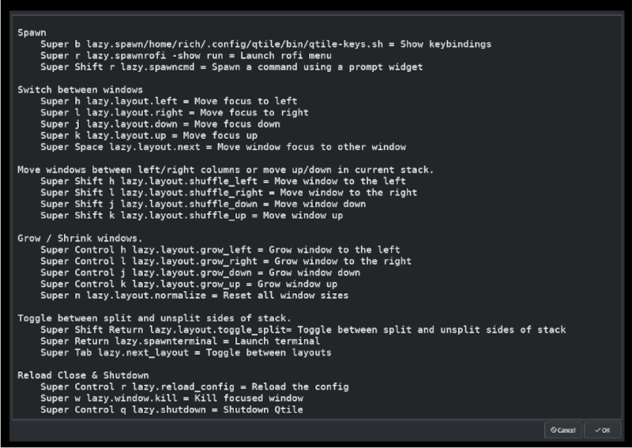

# qtile windows manager

### Quickly view keybindings in qtile

Script adapted from ["Want A List Of Your Keybindings? Write A Shell Script!"](https://www.youtube.com/watch?v=WkXyXIs-ZMI&t=1410s) by Distro Tube. The YouTube video shows how to put together a "Quick view keybindings" script for Xmonad. The script has been adapted to work on **qtile**. I suspect the ***sed - e*** regex stuff used in my adaption could be more efficient, but hey, it works! The script will likely have to change somewhat as I move forward with customising **qtile**.

[**Link to my adapted script -** ***qtile-keys.sh***](https://github.com/richee-w/dotfiles/blob/main/.config/qtile/bin/qtile-keys.sh)

The trickiest part was getting the ***sed -e*** regex stuff right but thanks to the **[gnu sed live editor](https://sed.js.org/) which was enormously helpful**,. I managed to do it.

The script lives in ***$HOME/.config/qtile/bin/*** and I have added the path to my ***$PATH*** environmental variable.  As I use ***"oh my bash"*** this is set in ***$HOME/omb-custom/bashrc.sh***. (A symlink was made from ***$HOME/.oh-my-bash/custom -> $HOME/rich/omb-custom/*** to avoid nested git repositories.)

***$HOME.config/qtile/config.py*** was modified to clean up the output and added the following keybinding to the keys section.

    Key([mod], "b", lazy.spawn("/home/rich/.config/qtile/bin/qtile-keys.sh"), desc="Show keybindings"),

Now I am able to view my keybindings very quickly.

